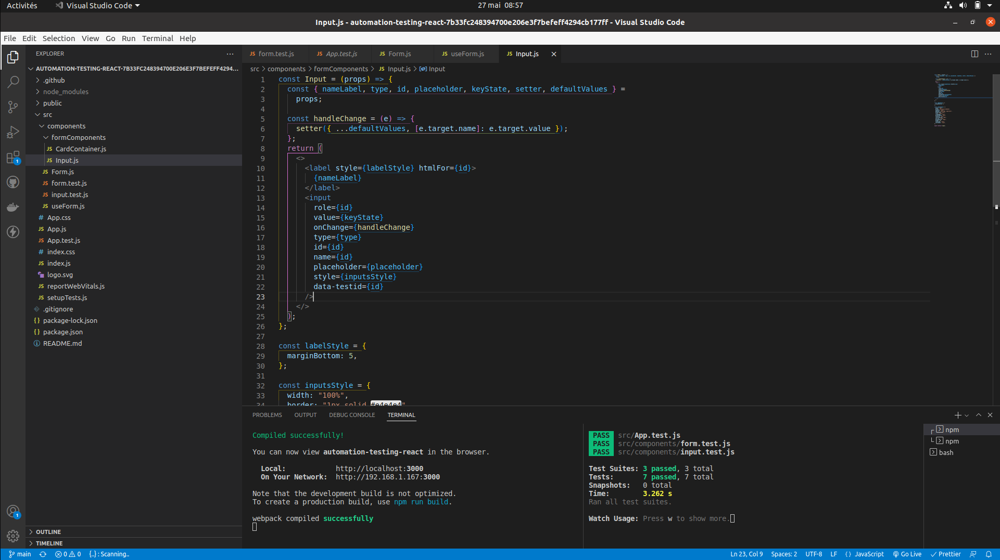
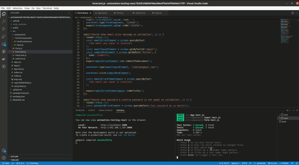
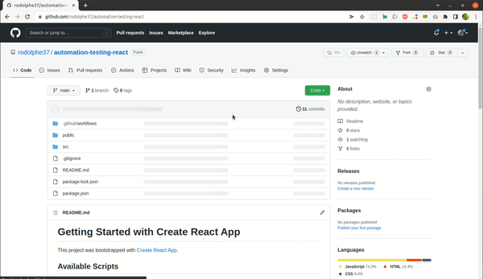

# Easy React example - automated testing: "reusable input component with github workflow!"

- **Little example ho to test your reusable input component (testing if each input is empty or not, email & password error message is in the document, etc...)**

---

## Quick Links

[Demo](#demo)

- [Picture](#picture-demo)

[Tech Stack](#tech-stack)

[Author](#author)

[License](#license)

---

### Picture Demo

**_Reusable input_**

**_Local tests_**

**_Github workflow automatic test_**

---

## Tech Stack

- [React](https://github.com/facebook/react)
  - Create-react-app with React testing library (jest)

---

## Author

- Rodolphe Augusto

---

## License

- MIT.

---

## Start project

- Clone this repo...
- Do in the console :
- `$ cd automation-testing-react`
- `$ npm i` or `$ npm install ` or `yarn`
  to install the dependencies and
- `$ npm start` or `yarn start`

Enjoy !
